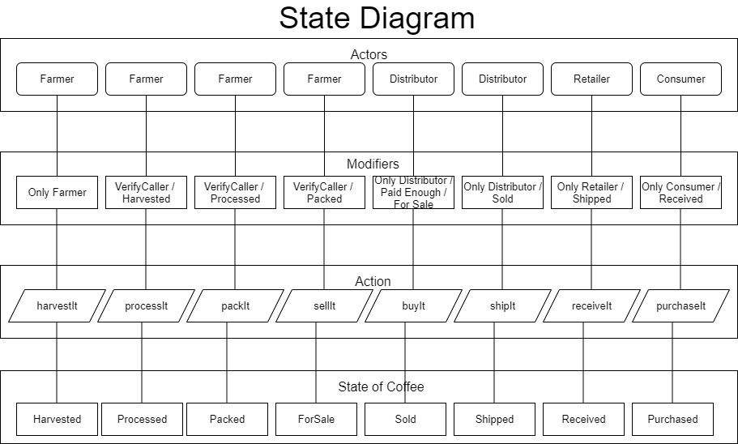

# Ethereum DApp for Tracking Items through Supply Chain

### Introduction

This project is a smart contract for a simple coffee supply chain with a number of different actors. It is written in Solidity in Visual Studio Code.

The project used the following library versions:

- Truffle v4.1.14 (core: 4.1.14)
- Solidity v0.4.24 (solc-js)
- Ganache UI v2.5.4 
- web3 v6.7.0

Truffle is used as the development, testing, and compiler environment for Ethereum smart contracts. We use it to compile the solidity code, migrate it, send it to the rinkeby test network, and also run the unit tests.

web3 is the Ethereum javascript API that allows the node.js front-end to interact with the smart contracts on the rinkeby test network.

The project does not use IPFS.

### UML Diagrams

#### Activity


#### Sequence


#### State


#### DataModel


### Output

The following is a list of the contract and transaction ids for the SupplyChain object:

Etherscan info:

- Transaction ID: [**0x502e5579722c14c9d4f38cfdc614693d3af27eccd8e5bb8a3162d3f1bb0eb56a**](https://rinkeby.etherscan.io/tx/0x502e5579722c14c9d4f38cfdc614693d3af27eccd8e5bb8a3162d3f1bb0eb56a)
- Contract: [**0x1B84e5261319F6e0FD2e0831976455384841A472**](https://rinkeby.etherscan.io/address/0x1b84e5261319f6e0fd2e0831976455384841a472)

The following are steps to compile the contracts developed in solidity:

1. Download and install npm and [ nodejs ]( https://nodejs.org/en/ ). 
2. Install [Ganache](https://www.trufflesuite.com/docs/ganache/quickstart) development blockchain. We utilized the Ganache user interface.


3. Install [Metamask](https://metamask.io/) Wallet for your browser. You can create a user account in Metamask then connect this account to the Rinkeby network. Copy your Metamask mnemonic and place it in the .env file (MNEMONIC variable):


4. Go to [Infura](https://infura.io) and create an account. Infura is used as a pathway from your app to the Ethereum network. Create a new Infura project or use an existing project. Copy the project id and place it in the .env file (API_URL variable). 

5. Now that all of the infrastructure is set up, open the project in Visual Studio Code (VSCode):


6. Open the terminal in VSCode and run 
    ```
    truffle compile
    ```
	
Everything should successfully compile.

7. Next, migrate it locally (using Ganache) so you can test
	```
    truffle migrate --reset
    ```
	
	

8. Now it's time to run the unit tests:
	```
    truffle test
    ```
	
It should display the following output if successful:


If the tests are successful, let's send it on over to the Ethereum Rinkeby test network:
	```
	truffle deploy --network rinkeby
	```
	
It should display a similar console output as the following:


Now, go to Etherscan [RinkebyEtherscan](https://rinkeby.etherscan.io) and type in the contract or transaction id to observe it on Rinkeby:


